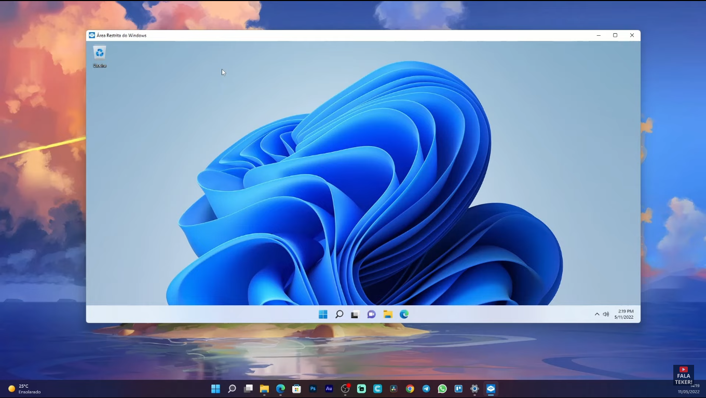
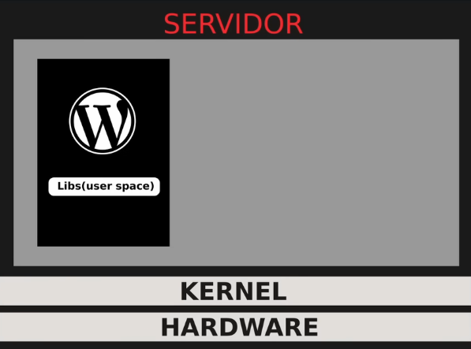
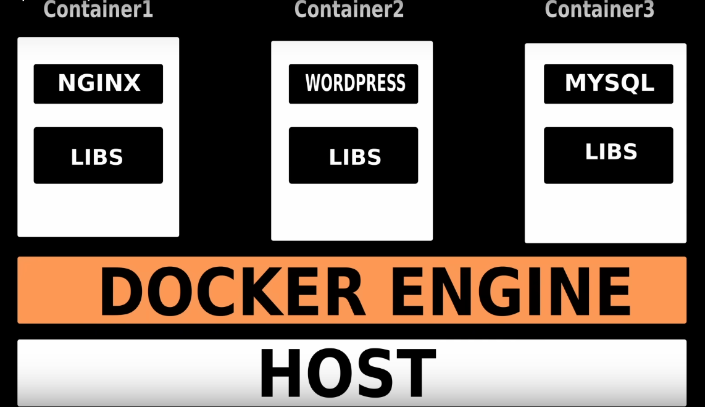

## Docker : Propósito semelhante as Máquinas virtuais
Máquinas virtuais é a possibilidade de possuir variados sistemas operacionais em apenas uma máquina. Isso sem particionar o disco, é a possibilidade de dentro de um SO rodando você inicializar outro SO.
Por exemplo, dentro de um Windows, ter a oportunidade de rodar um Ubuntu.
Isso porque uma máquina virtual consegue rodar um sistema operacional dentro de outro.
Uma máquina virtual pode executar SO's e aplicativos como se fosse uma máquina física, pois uma máquina virtual de certa forma particiona seu hardware, quando uma VM é criada, ela é atribuída uma quantidade específica de recursos de hardware, como CPU, memória, armazenamento e rede. Os recursos atribuídos a uma VM determinam a quantidade de desempenho que ela pode oferecer.
### Exemplo de um Windows 11 rodando dentro de outro Windows 11.

Ter uma VM quer dizer compartilhar seu hardware com cada VM, oque pode ser de certa forma desinteressante.
Isso porque na maioria das vezes é utilizado uma VM apenas como ambientes de desenvolvimento, testes, Hospedagem de apps, e para rodar apenas uma aplicação.
Dessa forma partir todo seu hardware as vezes para rodar apenas uma aplicação se torna um desperdício e pode custar muito do seu desempenho.

## Docker
O docker tem a mesma funcionalidade que uma VM, porém com recursos mais interessantes.
Diferente das VM's o docker não partilha seu hardware, não afetando totalmente o desempenho da máquina.

Diferente das máquinas virtuais, o docker consegue compartilhar recursos da própria máquina hospedeira como o kernel, sem partir seu hardware assim como em VM's. 

